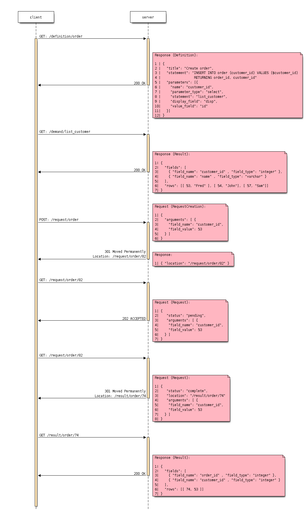

# Esqlate-Server

## What is the Esqlate project

Esqlate is an attempt to build a user interface that allows the quick creation of incredibly basic admin panels for people who can either read SQL, but who cannot necessarily write it or for people who wish to create a library of SQL operations / reports for a specific project.

It aims to give a reasonable web interface giving the user the ability to run queries while specifying the value of specific parameters (while other parameters will be restricted to the systems administrator).

## Overall Data Flow



## Note on Database Types

This software was always planned to support multiple databases but PostgreSQL was it's first target database. Currently this software also supports MySQL but sections of this README will make the assumption that you are setting up for PostgreSQL.

If you wish to use another database please see below:

 * [MySQL](#mysql-support)

## To install this project

### Starting a local, sample database.

First you need a PostgreSQL database, My favourite way to get a locally running PostgreSQL server is to create a simple `docker-compose.yml` file per project, but you can go about this however you wish:

```bash
echo '
version: "3"
services:
  db:
    image: postgres:11.4
    environment:
    - POSTGRES_USER=postgres
    - POSTGRES_PASSWORD=postgres
    - POSTGRES_DB=postgres
    ports:
    - "127.0.0.1:5432:5432"
    volumes:
    - postgres-data:/var/lib/postgresql/data
volumes: 
  postgres-data:' > docker-compose.yaml
```

### Import a sample data set

Then import a sample data set (in this case, Microsoft's Northwind dataset converted into PostgreSQL).

```bash
export PGHOST=127.0.0.1
export PGUSER=postres
export PGPASSWORD=postgres
export PGDATABASE=postgres
curl https://raw.githubusercontent.com/pthom/northwind_psql/5f9ba34aa1d980392685042037b0b1112d01bd32/northwind.sql | psql

# I Noticed that there were no `timestamp` / `timestamp with timezone` fields in
# the whole database and I felt I needed to test this important type... so....
echo "alter table orders add column order_timestamp timestamp" | psql
echo "update orders set order_timestamp = concat(order_date, ' ', floor(random() * 24)::varchar, ':', floor(random() * 60)::varchar, ':', floor(random() * 60)::varchar)::timestamp" | psql
echo "alter table orders drop column order_date" | psql
echo "create sequence employees_seq; select setval('employees_seq', (select max(employee_id) + 1 from employees), false); alter table employees alter column employee_id set default nextval('employees_seq');" | psql
```

### Create a definition for a query you wish to run

Next, create a definition file. These definition files are like templates for queries.

```bash

mkdir -p definition
echo '
    {
        "name": "customer_search_by_name_only",
        "title": "Customer Search",
        "description": "List customers using a substring search",
        "parameters": [{ "name": "search_string", "type": "string" }],
        "statement": "SELECT * FROM customers\nWHERE\n  LOWER(company_name) LIKE CONCAT('"'%'"', LOWER($search_string), '"'%'"') OR\n  LOWER(contact_name) LIKE CONCAT('"'%'"', LOWER($search_string), '"'%'"')"
    }' > definition/customer_search_by_name_only.json

```

NOTE: There are more example definitions for the Northwind dataset in the link:./example_definition[./example_definition directory].

### Lastly start the service

You are no ready to start the service:

```bash
export PGUSER=postgres
export PGPASSWORD=postgres
export PGHOST=127.0.0.1
export PGDATABASE=postgres

export DEFINITION_DIRECTORY="$PWD/definition"
export ADVERTISED_API_ROOT=http://localhost:8803 # This can cause issues with redirects in browsers. Using `/` fixes the problem, but I like full URL locations.
export LISTEN_PORT=8803

npm run-script build
npm start
```
## Testing the API

The most basic thing you can do is get a definition:

```bash
curl -v http://localhost:8803/definition/customer_search_by_name_only
```


Suppose you want to do something useful however, such as actually run the query:

```bash
curl -v -H "Content-Type: application/json" \
    -X POST \
    --data '{"arguments": [{ "name": "search_string", "value": "Simon" }]}' \
    http://localhost:8803/request/customer_search_by_name_only
```

The output of this will look similar to the following

```bash
> POST /request/customer_search_by_name_only HTTP/1.1
> Host: localhost:8803
> User-Agent: curl/7.64.0
> Accept: */*
> Content-Type: application/json
> Content-Length: 59
>
* upload completely sent off: 59 out of 59 bytes
< HTTP/1.1 202 Accepted
< X-Powered-By: Express
< Access-Control-Allow-Origin: *
< Location: /request/customer_search_by_name_only/oDzS9suv
< Content-Type: application/json; charset=utf-8
< Content-Length: 48
< ETag: W/"30-K4lHAC8iwpUSjSDR/g3P1KLFAUU"
< Date: Tue, 24 Sep 2019 09:35:24 GMT
< Connection: keep-alive
<
{"location":"http:/localhost:8803/request/customer_search_by_name_only/Uz9rkntC"}
```

Using the above URL will allow you to monitor the request:

```bash
curl -v http:/localhost:8803/request/customer_search_by_name_only/Uz9rkntC
```

It is likely that your request has already `"complete",` or in `"preview"` (meaning the not all other formats are coomplete) giving you the result below. However Esqlate is designed as a Queue based system so the system administrator has some degree of control how much load you wish to put on your PostgreSQL server. If it is not yet complete or in preview you will get the resonse  `{ "status": "pending" }` and will need to re-issue the request.

```bash
> GET /request/customer_search_by_name_only/uQEnGH1z HTTP/1.1
> Host: localhost:8803
> User-Agent: curl/7.64.0
> Accept: */*
>
< HTTP/1.1 301 Moved Permanently
< X-Powered-By: Express
< Access-Control-Allow-Origin: *
< Location: http:/localhost:8803/result/customer_search_by_name_only/uQEnGH1zDLaT
< Content-Type: application/json; charset=utf-8
< Content-Length: 91
< ETag: W/"5b-3tdNMonceUSkJklVx8nakJZihfY"
< Date: Tue, 24 Sep 2019 09:39:48 GMT
< Connection: keep-alive
<
{"status":"preview","location":"http:/localhost:8803/result/customer_search_by_name_only/Uz9rkntC9reP"}
```

Now you know that the request is in `"preview"` or `"complete"` and the location to request the results:

```bash
curl http:/localhost:8803/result/customer_search_by_name_only/Uz9rkntC9reP
```

```json
{
  "fields": [
    { "name": "customer_id", "type": "bpchar" },
    { "name": "company_name", "type": "varchar" },
    { "name": "contact_name", "type": "varchar" },
    { "name": "contact_title", "type": "varchar" },
    { "name": "address", "type": "varchar" },
    { "name": "city", "type": "varchar" },
    { "name": "region", "type": "varchar" },
    { "name": "postal_code", "type": "varchar" },
    { "name": "country", "type": "varchar" },
    { "name": "phone", "type": "varchar" },
    { "name": "fax", "type": "varchar" }
  ],
  "rows": [
    [
      "NORTS",
      "North/South",
      "Simon Crowther",
      "Sales Associate",
      "South House 300 Queensbridge",
      "London",
      null,
      "SW7 1RZ",
      "UK",
      "(171) 555-7733",
      "(171) 555-2530"
    ],
    [
      "SIMOB",
      "Simons bistro",
      "Jytte Petersen",
      "Owner",
      "Vinbæltet 34",
      "Kobenhavn",
      null,
      "1734",
      "Denmark",
      "31 12 34 56",
      "31 13 35 57"
    ]
  ],
  "full_data_set": false,
  "full_data_sets": [
    { "type": "text/csv", "location": "http:/localhost:8803/result/customer_search_by_name_only/Uz9rkntC9reP.csv" }
  ],
  "status": "complete"
}
```

**Note:** If you wish to circumvent the Queue you can use the below which will give you immediate and full results:

```bash
curl -v -H "Content-Type: application/json" \
    -X POST \
    --data '{"arguments": [{ "name": "search_string", "value": "Simon" }]}' \
    http://localhost:8803/demand/customer_search_by_name_only
```

## MySQL Support

#### Import a sample data set

Then import a sample data set (in this case, Microsoft's Northwind dataset converted into MySQL).

```bash
export MYHOST=127.0.0.1
export MYUSER=root
export MYPASSWORD=mysql
export MYDATABASE=northwind

echo "create database if not exists northwind" | mariadb -u"$MYUSER" -p"$MYPASSWORD" -h"$MYHOST" -D"$MYDATABASE"
curl https://raw.githubusercontent.com/dalers/mywind/master/northwind.sql | mariadb -u"$MYUSER" -p"$MYPASSWORD" -h"$MYHOST" -D"$MYDATABASE"
curl https://raw.githubusercontent.com/dalers/mywind/master/northwind-data.sql | mariadb -u"$MYUSER" -p"$MYPASSWORD" -h"$MYHOST" -D"$MYDATABASE"

echo "alter table shippers change column company company_name varchar(50)" | mariadb -u"$MYUSER" -p"$MYPASSWORD" -h"$MYHOST" -D"$MYDATABASE"

```

To run eSQLate using MySQL you will need to define the MY* environmental variables above as well as `DATABASE_TYPE` which should be set to `"MySQL"`. Once you have done this eSQLate will switch to using the MySQL driver.

NOTE: Very little of the example definitions will work due to differences between the PostgreSQL schema and the MySQL schema. I have added a `shipper_search` example_definition file which will work in both PostgreSQL and MySQL.

However if you launch esqlate-server the shipper_search will now run

```
$ export URL_ROOT="http://localhost:8803"
$ curl -H "Content-Type: application/json"     -X POST     --data '{"arguments": [{"name": "company_name", "value":"PS"}]}'     ${URL_ROOT}/request/shipper_search
{"location":"/request/shipper_search/FGAruVhE"}
$ curl -H "Content-Type: application/json" ${URL_ROOT}/request/shipper_search/FGAruVhE
{"status":"complete","location":"/result/shipper_search/FGAruVhE9Dxe"}
$ curl -H "Content-Type: application/json" ${URL_ROOT}/result/shipper_search/FGAruVhE9Dxe | jq .
{
  "fields": [],
  "rows": [],
  "full_data_set": true,
  "status": "complete",
  "full_format_urls": [
    {
      "type": "text/csv",
      "location": "/result/shipper_search/FGAruVhE9Dxe.csv"
    }
  ]
}
```

## Version History

 * 1.0.0 - Initial Release
 * 1.1.0 - Support added for multiple database support (MySQL)
 * 1.0.1 - Fix bug #9 - Unable to use a parameter named `user_id`
 * 1.1.1 - Merge #9 into 1.1
 * 1.1.2 - Fix not releasing MySQL connections.

## License

This project (all code in this repository) is listed under GPLv3 or later

