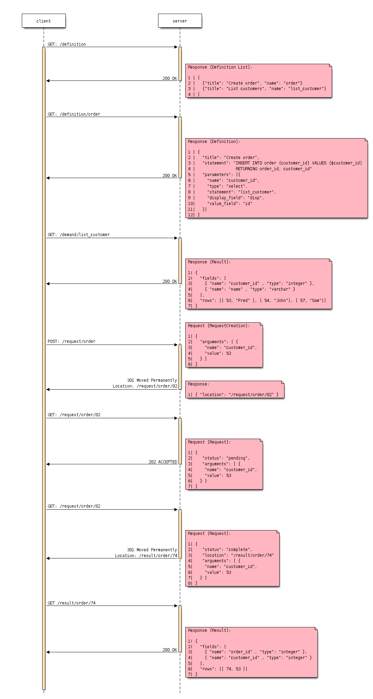

# Esqlate-Server

## Web Requests

 * / => /index.html
 * /milligram.css
 * /index.css
 * bundle.js
 * http://localhost:8802/node_modules/esqlate-lib/test/res/definition/list_customer_with_credit_above.json
 * http://localhost:8802/node_modules/esqlate-lib/test/res/result/list_customer_with_credit_above.json
 * [normalize.css / fonts (Roboto) / favicon.ico ]

## Schemas

 * definition
 * results

## Requests Plan

GET :definition => Gets a definition
POST :defintion/ - JSON body => Resp 302 :defintion/result/:id
GET :defintion/result/ => Resp 200 - { "status": "pending" } / { "status": "complete" } ( or redirect )

## Default implementation

 * Takes user input from `request.params`, `request.query`.
 * Takes server input from `request.session`.

## Implement Middlewares

Middleware will be a higher order function wraps a promise returning function and handless `next` calls.

 * Capture Start
 * Normalize Definition
 * Pulling Values (Only from Definition)
 * Getting Connections?
 * Run Definition
 * Freeing Connections?
 * Log
